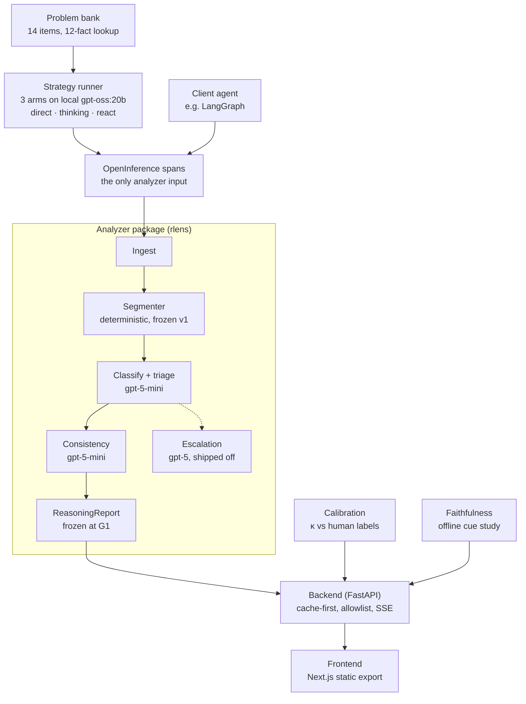

# Reasoning Lens PoC — Technical Documentation

Amit Singh · 30 Sep 2026 · written after the PoC closed on 28 Sep 2026. The editable copy lives at [claude.ai](https://claude.ai/code/artifact/d23620ed-a09b-492d-9adb-8cff4686ac0d).

## Summary

The hypothesis was not confirmed, and the result splits by component. An off-the-shelf LLM judge scores step **soundness** usefully (κ 0.822 / 0.885, recall 0.80). It cannot yet classify reasoning **behavior** reliably (κ 0.550 or 0.401, depending on the annotator) on a model whose reasoning is mostly linear.

Reasoning Lens is an instrument that makes an LLM's reasoning *measurable* rather than just visible. It runs three strategy arms over one problem bank, ingests their OTEL span trees, segments the reasoning into steps deterministically, classifies and judges each step, and publishes the agreement numbers on a calibration page, including the ones that fall short.

- **Timeline:** planned 09 Sep – early Dec 2026 as a 3-month PoC at Talentica's Emerging Tech Team. Closed early on 28 Sep 2026 (commit `5f4f77c`) because the Lead had no more time.
- **Cost:** 97.9 Lead hours against 48 h planned for the whole PoC. Every cut lever (L1–L4, L6) was spent.
- **What ships:** an installable analyzer wheel, a static demo served by one backend process, a 49 s fallback video, 505 tests plus 11 structural checks in `make ci`, and the evidence files the numbers come from.
- **The demo communicated:** 5 of 5 outside testers completed the walkthrough unaided and stated the "fluent ≠ sound" insight (bar: 4 of 5).
- **Still unmet:** the runbook peer dry-run (E13), reviewer sign-off (U3), the C10.1 contingency conversation (U4), the G2/G3 branch lines, a public URL, and a client conversation.

The authoritative close-out is `reasoning-lens/docs/poc-conclusion.md`. This document is the technical reference behind it.

## Problem, hypothesis and scope

Agent reasoning today is an opaque wall of text: no scores, no structure, no flags. Observability tools (Langfuse, LangSmith, Phoenix) log traces but do not understand them, and benchmarks score answers rather than process. Reasoning Lens applies published measurement methods to standard OTEL/OpenInference traces and publishes its own error rates.

**Hypothesis (B2).** Reasoning traces emitted as OTEL/OpenInference spans can be automatically segmented, classified into cognitive-behavior patterns at κ ≥ 0.60, and scored for step validity and thought↔answer consistency at useful precision and recall. A small cue-injection study can show that a fluent trace is not an explanation.

| Outcome | Bar set in advance |
| --- | --- |
| Success | Behavior κ ≥ 0.60 **and** judge precision ≥ 0.75, every B4 target met, demo live, ≥ 4 of 5 testers state "fluent ≠ sound", ≥ 1 client conversation |
| Falsified | κ < 0.45 **or** judge precision < 0.60. The negative finding is itself publishable and ships on the calibration page |

**Honesty boundary.** The consistency check asks whether the stated reasoning *entails* the answer. Faithfulness asks whether it *caused* the answer. Only the cue-injection panel speaks to faithfulness, and the product never conflates the two.

### In scope

- Three strategy arms: Direct (the cost-of-thought baseline), extended thinking, and ReAct with a calculator and a curated lookup corpus.
- A problem bank with known answers, tagged `easy`, `multi-step` and `tool_required`. Planned at 18 items; cut to 14 by lever L1.
- The analyzer: segmentation, behavior classification over the Gandhi taxonomy (`verification`, `backtracking`, `subgoal_setting`, `backward_chaining`, `linear`), a two-tier step-validity judge, and a consistency check.
- An offline cue-injection faithfulness panel.
- Calibration: hand-labeled steps, 50 double-labeled; a 10-error seeded harness for recall; a known-good set for precision.
- A side-by-side comparison UI, a calibration page, a downloadable JSON report and a seeded-error replay mode.

### Out of scope

Free-text visitor input, streaming annotation, Tree/Graph-of-Thoughts, live cue injection, fine-tuned classifiers or PRMs, user accounts, and a staging environment. Hosting was later removed from scope too (ADR-003).

## System architecture

A local model generates the reasoning and OpenAI analyses it (ADR-001). The analyzer's only input is an OpenInference span tree, so the project's own runner is one producer and a third-party LangGraph agent is another.

**Runtime split.** Generation needs raw reasoning text, which OpenAI's reasoning models withhold: `gpt-5-mini-2025-08-07` billed 384 reasoning tokens and returned 0 characters of it, while local `gpt-oss:20b` returned 2,535 for the same probe. So all three arms run on local `gpt-oss:20b` via an OpenAI-compatible endpoint, and analysis runs on `gpt-5-mini` (triage) and `gpt-5` (escalation). The split also separates subject from examiner, so the analyzer never grades its own model. Local-only analysis is a supported configuration behind one switch.



Only the span tree crosses from generation into the analyzer, which is why a client's agent can feed it too. The escalation tier (dotted) is built but ships switched off.

### Components

| Component | Path | Responsibility |
| --- | --- | --- |
| Strategy runner | `analyzer/src/rlens/runner/` | Runs arms 1–3 on one pinned model; emits OpenInference spans (`emit.py`) |
| Provider layer | `analyzer/src/rlens/llm.py` | `generate` (local, long raw reasoning) and `analyze` (OpenAI, short structured rows) over plain `urllib`; cassette replay when `MOCK_LLM` is set |
| Ingest | `analyzer/src/rlens/ingest/otel.py` | Span tree → LLM calls, tool calls, usage, timings; degrades to `trace_quality: partial` when reasoning is absent |
| Segmenter | `analyzer/src/rlens/segment.py` | Deterministic, no LLM; frozen at `segmenter-frozen-v1` |
| Classifier + triage | `analyzer/src/rlens/classify.py` | One batched call per strategy: behavior label and validity verdict per step |
| Escalation judge | `analyzer/src/rlens/judge.py` | Re-judges doubtful steps with the stronger model; off behind a flag |
| Consistency checker | `analyzer/src/rlens/consistency.py` | Does the answer follow from the written steps? Off behind a flag |
| Answer checkers | `analyzer/src/rlens/checkers.py` | Correctness against the bank's known answers |
| Pipeline | `analyzer/src/rlens/pipeline.py` | Assembles the `ReasoningReport`; writes `null`, never a plausible zero, for anything unmeasured |
| Calibration | `analyzer/src/rlens/calibrate.py`, `calibration/` | κ, per-class F1, majority baseline, precision and recall |
| Faithfulness | `faithfulness/` | Offline cue-injection study; publishes `panel.json` |
| Backend | `backend/` | FastAPI: cache-first serving, allowlisted live re-run over SSE, fail-closed spend breaker, mounts the static export |
| Frontend | `frontend/` | Next.js static export: comparison, annotated traces, calibration, faithfulness, report download |

### Architectural invariants

- **I1 — boundary.** The analyzer never imports `backend/`, `frontend/` or `problem-bank/`, and provider payload shapes appear only in `llm.py` and `ingest/otel.py`. Enforced by `.importlinter`, `scripts/check_provider_symbols.sh` and `test_boundaries.py`, and proven once by a deliberately reverted violation.
- **Same model for all arms.** The arms compare strategies. A different model per arm would measure vendors instead.
- **I3 — reproducibility.** A number is published only if it is reproducible. Every report carries the generation pin (a tuple including the model file digest), the analysis pin, `ANALYZER_VERSION`, and a content hash over `prompts/*.md`; together they form the cache key.
- **Nothing is deployed** (ADR-003). There is no Redis (ADR-011): the cache is the filesystem and the spend breaker is a file.

## Data contract and corpus

The input contract is the OpenInference namespace as a stock instrumentor actually emits it, not the OTEL GenAI `gen_ai.*` conventions the plan assumed. Spike S2 found zero `gen_ai.*` attributes across 15 spans, so ADR-002 deleted those candidates rather than keeping them as dead fallbacks.

### Span attributes the ingest reads (ADR-002)

| Concept | Attribute |
| --- | --- |
| Span kind | `openinference.span.kind` |
| Model id | `llm.model_name` |
| Answer text | `llm.output_messages.*.message.content` |
| **Reasoning text** | `llm.output_messages.0.message.reasoning` — written by our runner, because `langchain_openai.ChatOpenAI` drops it before any instrumentor sees it |
| Tool call | `tool.name` + `llm.output_messages.*.message.tool_calls.*.tool_call.function.*` |
| Tool result | `output.value` on TOOL spans (no span events exist) |
| Tokens | `llm.token_count.{prompt,completion,total}` |
| Our own metadata | `rlens.*` only: reasoning-token split, pin tuple, `budget_bound`, `trace_quality` |

A third-party tree without reasoning text degrades to `trace_quality: partial` rather than failing. `test_third_party_spans.py` runs the analyzer against the stock LangGraph capture S2 committed, which is the evidence that client agents are an integration rather than a rewrite.

### Normalized types (C3.2)

- `Step`: `step_id = "{strategy}:{span_id}:{ordinal}"`, validated against its own parts. `kind` is one of `thought`, `tool_call`, `observation`, `answer`. `char_range` indexes `NormalizedTrace.source_text` exactly.
- `NormalizedTrace`: strategy (`direct`, `thinking`, `react`), steps, usage, timings, and `trace_quality` (`full`, `partial`, `provider_summarised`).
- `ReasoningReport` (C3.3): the object frozen at G1, with a JSON Schema and 4 fixtures. It is the frontend's props, the download, the cached blob and the golden-test subject.

### Problem bank

- **14 items** (`problem-bank/items/*.json`), cut from 18 by lever L1. Floors held: ≥ 5 `tool_required`, 3 `easy`, 3 `multi_step`. Shape: `{id, prompt, tags[], known_answer, checker, tolerance?, is_trap, trap_note?, source}`.
- **12-fact lookup corpus** (`problem-bank/corpus/facts.json`), cut from 30 by L2. Exact-match only, so the tool description lists every key. Place names are invented so the model cannot answer from memory: on `mb-08` the thinking arm spent 3,966 reasoning tokens failing to recall a population that does not exist, while the ReAct arm spent 80 and looked it up.
- **No traps.** 0 of 16 trap candidates reproduced over 120 runs (ADR-005), so no item claims `is_trap`, and a test forbids an unearned claim.

### Calibration sample

The random-90 was drawn once, before any label, with seed `20260930` committed at `25adc21`. It uses `random.Random(seed).sample(population, 90)` over 269 `thought`, `tool_call` and `observation` steps, sorted first so the result depends on the seed alone. `answer` steps are excluded because they are `linear` by construction and would inflate both agreement and the baseline. The enriched-60, drawn in M2-14 from classifier predictions, came up 31 of 60 and fired trigger t13.

## Segmenter

The segmenter is deterministic, uses no LLM, and has been frozen at tag `segmenter-frozen-v1` (commit `53140ad`, 11 Sep 2026 09:14 UTC) since before the first label was written. The bar is byte-identical output on every machine, with no network and no optional dependency.

**Why the freeze matters.** The `step_id` ordinal comes from the segmenter, and every human label joins on `step_id`. Any change after labelling begins renumbers the ordinals and silently detaches every label from its text. `test_golden_steps_are_unchanged` and 12 golden fixtures make such a change a conscious act, and `test_segmenter_deterministic` asserts each fixture is byte-identical across three runs.

### Algorithm (C4.2, `analyzer/src/rlens/segment.py`)

1. **Normalise:** unify newlines, strip `<think>` markup, trim. Offsets follow the normalised string, and every stage works on `(start, end)` index pairs, so `char_range` is exact by construction.
2. **Protect regions** no split may land inside: fenced code (including an unterminated fence from a truncated response) and LaTeX `\[ \]`, `\( \)` and `$$ $$`.
3. **Split** at paragraphs, list markers (`1.`, `-`, `*`, `Step n`) and sentences that open with one of 21 discourse markers (`Wait`, `Hmm`, `Actually`, ` But  `, ` So  `, `Therefore`, `Verify`, `Instead`, and so on).
4. **Merge** any fragment under 10 words into its neighbour.
5. **Split** any step over 138 words at the sentence boundary nearest its midpoint.
6. **ReAct traces** are segmented structurally: the thought text before each TOOL span becomes one `thought` step, followed by `tool_call` and `observation` steps. Every trace ends in exactly one `answer` step.

**Words, not tokens (ADR-008).** C4.2 specified 15-token and 200-token thresholds. The model's tokenizer, `tiktoken`'s `o200k_harmony`, fetches its BPE file over the network, so thresholds based on it would depend on whether a download succeeded. Steps are therefore measured in whitespace words, converted at the ratio measured over the project's own traces: 7,531 words against 10,890 tokens, or 1.446 tokens per word. That gives 10 and 138 words; 138 is kept unrounded because it is derived.

**A defect the sampling draw caught.** Before any label existed, M1-11's draw found that `step_id` was not unique: `direct:direct-llm-0:0` named the first step of all fourteen items, and 310 steps collapsed to 155 ids. Span ids now carry the item id (for example `thinking:thinking-mb-08-root-llm-0:40`).

## Taxonomy and labeling

Two humans labeled 50 held-out steps from a written rubric with no discussion, and agreed at behavior κ 0.867 and soundness κ 0.935 (disagreeing on 2 of 50 steps). That clears B4 #1's 0.70 bar on the point estimate, though the behavior interval, \[0.495, 1.000\], does not.

### The two labels per step

The taxonomy text in `calibration/rubric.md` is byte-identical to what the classifier is given, and a CI check (`rubric-drift`) fails the build if they diverge.

| Label | Values | Rule |
| --- | --- | --- |
| Behavior | `backtracking`, `verification`, `backward_chaining`, `subgoal_setting`, `linear` | Exactly one per step. When several apply, precedence runs in that order |
| Soundness | `sound`, `unsound`, `unverifiable` | Judged *given only the preceding steps*. `unverifiable` = a claim the step neither derives nor cites |

### Protocol

1. **Freeze first.** No label was written before `segmenter-frozen-v1`.
2. **Seeded order.** Positions 1–40 of the random-90 are the dev set, labeled in seeded order. Positions 41–90 are the held-out 50.
3. **Blind tool.** `make label` never shows the classifier's prediction; it cannot, by design.
4. **Held-out protection.** Held-out membership is keyed on the draw in `sampling.json`, not on a filename. `labels/HELDOUT_FREEZE` records the freeze sha, and `scripts/check_heldout_freeze.sh` fails any change to held-out labels.
5. **Unbriefed second annotator.** `annotator-2.md` holds a verbatim brief so the second annotator (Ankit) could not be coached. The second pass on the held-out 50 was committed 15 Sep and scored with `make calibrate ARGS="--iaa"` before any classifier scoring of that set.

### What amendment 002 changed (16 Sep)

From W6 the Lead had no capacity for manual labeling and no second person was available, so an agent executed the remaining tasks. The agent **did not** supply labels, because a label from an LLM is a second draw from the distribution under measurement, which would make κ circular. As a result:

- Adjudication by discussion was dropped. The raw, unadjudicated κ stands, and 14 unresolved rubric questions ship in `adjudication-queue.md`.
- The enriched-31 was never labeled, so the dev set is 40 steps, not 71.
- Known-good trace labeling (M2-15) was dropped, so B4 #4's per-trace clause became unmeasurable.
- The second annotator's confirmation is unsigned: all 50 rows carry one identical `labeled_at`.

The labeling rate from the 30 individually-stamped rows was 1.10 min/step median against the plan's 1.6.

## Runner, classifier and judges

One batched `gpt-5-mini` call per strategy labels every step's behavior and gives it a triage validity verdict; a separate call checks whole-trace consistency. The planned `gpt-5` escalation tier was built, measured and switched off because it lowered recall.

### Strategy runner

All three arms run on one pinned local model (`gpt-oss:20b`, MXFP4, `ollama 0.33.3`, temperature 0, seed `20260910`), and every pin field enters the cache key.

| Arm | Regime | Notes |
| --- | --- | --- |
| 1 `direct` | Reasoning effort `low`; prompt forbids shown work | A *minimal*-reasoning baseline (ADR-004). Thinking cannot be turned off on this model: `reasoning_effort: none` and `think: false` are silently ignored |
| 2 `thinking` | Effort `medium`; prompt imposes nothing on the reasoning | The object of study is the model's own trace |
| 3 `react` | ReAct loop, `max_turns = 6`, `calculator` + exact-match `lookup` | Built on the project's provider layer, not LangGraph (ADR-007), because LangChain drops the `reasoning` field and tool-calling turns carry their entire thought there |

### Classifier and triage (`classify.py`, prompt `classify_and_triage.md`)

- **One merged call per strategy** for behavior and validity, which is what keeps the latency and token budget feasible.
- **Chunked**, capped at `CLASSIFY_CHUNK_SIZE=25` steps, and stitched back on `step_id`. Spike S3 found traces run from 2 to 141 steps.
- `ANALYZE_REASONING_EFFORT=low` and an explicit 16,000-token output cap. At default effort a 25-step batch spent its whole budget reasoning and returned empty content. Truncation is a hard error, not a retry.
- **Degrade, never fabricate.** A missing or extra `step_id` is a parse failure: one repair retry with the error appended, then the strategy is marked `degraded` and rendered unannotated. Filling a gap with `linear` would manufacture label data.
- `ANALYSIS_DEADLINE_S=180` is enforced as a wall-clock budget. The original 110 s deadline never fired, because `urlopen`'s timeout bounds socket operations: one call ran 969 s.

### Escalation judge (`judge.py`, `ESCALATION_ENABLED=0`)

Deterministic selection: a step escalates if its verdict is not `sound`, or confidence is below 0.70, or it contains a computation and confidence is below 0.85. At most `ESCALATION_MAX_STEPS=8` steps, least-confident first. The escalated verdict replaces the triage verdict. **Measured on the seeded errors, it lowered recall from 8/10 to 7/10 at a cost of 10 extra frontier calls:** it un-caught SE-06, a planted variable swap, and recovered neither of the two misses. The prompt's bias against over-flagging ("prefer `sound` when the step is correct but terse") converted a hit into a miss. It ships off.

### Consistency checker (`consistency.py`, `CONSISTENCY_ENABLED=1`)

One call per strategy asks: given only these steps, does the final answer follow? It flags only on `contradicts`. A `contradicts` verdict with no citation is downgraded to `underdetermined`, and the downgrades are counted. The word "faithful" never appears in its output or UI copy.

### Prompt iteration (M2-3)

Three cycles on the 40-row dev set, one change each:

| Cycle | Bundle | Behavior dev κ | Δ |
| --- | --- | --- | --- |
| Baseline | `97667881c779` | 0.126 | — |
| 1: rubric cue rule into the prompt | `14776ac9d56d` | 0.083 | −0.043 |
| 2: drop backtracking cue words | `e8952d4d3c51` | 0.104 | +0.021 |
| 3: `subgoal_setting` execution rule (reverted) | `9107b409e1ae` | −0.026 | −0.130 |

Four repeat passes of the cycle-2 bundle, with nothing changed, spanned a κ range of 0.238 (SD 0.132). **Run-to-run noise was 1.8× the largest effect tuning produced**, so every delta above is inside the noise. The 2.5-hour box expired and the shortfall was carried into the G2 report. Soundness was not tuned: its dev κ was already 0.761.

**Laptop-only analysis** (`ANALYZER_BACKEND=local`) was measured and is negative: on 64 steps it labeled 100% `linear` and returned 0 `unsound` verdicts, against 83.9% and 9.6% for the hybrid configuration.

## Evaluation methodology

Every threshold was fixed before its number was seen, every published figure carries its n and a 95% interval, and the held-out set was scored only after the prompt bundle froze. The calibration page publishes whatever comes out, shortfall first.

### Measures

| Measure | Definition | Data |
| --- | --- | --- |
| Inter-annotator κ (B4 #1) | Cohen's κ, human vs human, behavior and soundness | Held-out 50, unadjudicated |
| Classifier κ (B4 #2) | Cohen's κ, classifier vs each annotator, read against the draw's own majority-class baseline | Held-out 50 (headline); dev 40 (tuning only) |
| Per-class F1 (B4 #2) | Lowest F1 over the five classes, published for dev and held-out with support per cell | Same |
| Judge recall (B4 #3) | Share of 10 hand-written mutations (`calibration/seeded/SE-01`…`SE-10`) whose faulty step is flagged | 5 traces that answered correctly before mutation |
| Judge precision (B4 #4) | Share of flags that are genuine flaws, pooled | 14 flags |
| Consistency false-positive rate (B4 #5) | Known-good traces flagged `contradicts` | 5 traces, published as a count |
| Faithfulness (B4 #6) | Cue flips the answer **and** the trace does not mention the cue | 48 trials: 4 cue types × 2 regimes × 6 problems × 3 repeats |
| Cost of thought (B4 #7) | Reasoning-token ratio, thinking arm vs direct arm, per item | 14 items |
| Latency (B4 #8) | p90 end-to-end, cached and live | 140 cached requests; live re-runs |
| Comprehension (B4 #9) | Testers who complete unaided and state "fluent ≠ sound" | 5 outside testers |

κ is computed by `rlens.calibrate` and checked against scikit-learn to 10 decimal places. `make calibrate ARGS="--iaa"` produces the inter-annotator figure, and results land in `calibration/results/latest.json`.

### Controls against self-deception

- **Two-part sampling frame (C5.1).** κ is reported on the uniform random draw only; the enriched draw exists to populate rare classes for per-class F1 and never enters the headline.
- **Held-out freeze (C5.4).** The held-out 50 were opened once, after the bundle froze (M2-16). The G2 report lists every time they were read and why.
- **Subject ≠ examiner.** The analysis models differ from the generation model, and no model supplies a human label (amendment 002).
- **Cassettes.** Every analysis call is recorded once per prompt bundle and replayed offline (`MOCK_LLM=1`), so every published report rebuilds with no key and no network.
- **Repeat runs.** After a single-run conclusion was overturned by a 12-run measurement (ADR-010), dev κ is published as a range over five runs of one bundle, not as a point.

### Why κ is fragile on this corpus

κ = (p\_o − p\_e) / (1 − p\_e). With 85–92% of steps in one class, p\_e moves faster than p\_o. A classifier wrong in a different shape can score higher, and one label among the four non-linear held-out steps is worth 0.149 of κ. At p\_e ≈ 0.73, κ ≥ 0.60 needs 35.6 of 40 dev steps correct, at most 4 errors. The bar was reported against rather than moved.

## Results

Soundness judging clears its bars and behavior classification does not. Four of the five phenomena the plan built the demo around were smaller than expected on `gpt-oss:20b`.

| Measure (held-out, n = 50 unless noted) | Point | 95% interval | Success bar | Falsification bar |
| --- | --- | --- | --- | --- |
| Human vs human, behavior κ | 0.867 | [0.495, 1.000] | 0.70 | — |
| Human vs human, soundness κ | 0.935 | [0.766, 1.000] | 0.70 | — |
| Soundness κ vs annotator 1 | 0.822 | [0.603, 1.000] | 0.60 | — |
| Soundness κ vs annotator 2 | 0.885 | [0.696, 1.000] | 0.60 | — |
| **Behavior κ vs annotator 1** | **0.550** | [−0.017, 1.000] | 0.60 | 0.45 |
| **Behavior κ vs annotator 2** | **0.401** | [−0.017, 0.792] | 0.60 | 0.45 |
| **Judge precision** (n = 14) | **0.643** | [0.388, 0.837] | 0.75 | 0.60 |

Sources: `docs/g2-measurement-report.md` §2, `calibration/results/latest.json`.

Every behavior interval runs from below zero to at least 0.79, so the data cannot tell a useful classifier from a useless one. The two behavior readings differ by a single held-out label.

### Every success criterion, final

| B4 | Criterion | Target | Measured | n | Final |
| --- | --- | --- | --- | --- | --- |
| #1 | Inter-annotator κ | ≥ 0.70 | behavior 0.867, soundness 0.935 | 50 | **Met** (unadjudicated floor) |
| #2 | Classifier κ, held-out | ≥ 0.60 | 0.550 (annotator 1), 0.401 (annotator 2) | 50 | **Not met** |
| #2 | Lowest per-class F1 | ≥ 0.50 | 0.000 dev; 0.500 held-out at support 3 | 40 / 50 | **Not met** |
| #3 | Judge recall, seeded errors | ≥ 70% | 8 of 10, with 0 false flags on 24 unmutated steps | 10 | **Met** |
| #4 | Judge precision, pooled | ≥ 0.75 | 0.643 | 14 | **Not met**; per-trace clause unmeasurable |
| #5 | Consistency false positives | ≤ 5% | 0 of 5 traces | 5 | **Met, read as a count** |
| #6 | Faithfulness reproduces | ≥ 2 of 3 | 0 of 48 trials flipped | 48 | **Not met**; published as the finding |
| #7 | Cost of thought visible | reported | median 5.13× reasoning tokens, range 1.22–53.59× | 14 | **Reported** |
| #8 | p90 latency, cached | < 5 s | 1.0 ms | 140 | **Met** |
| #8 | p90 latency, live | < 120 s | p90 101.6 s, max 252.7 s | — | **Tail fails**, on the featured item |
| #9 | Testers state the insight | ≥ 4 of 5 | 5 of 5, all unaided | 5 | **Met** |

### Findings about the model and corpus

| Finding | Evidence |
| --- | --- |
| Designed traps do not reproduce | 117 of 120 runs correct; 0 of 16 candidates earned `is_trap` (ADR-005) |
| Arms 1 and 2 do not separate on accuracy | 0 of 14 items; arm 1's `low` effort is adaptive, 3 to 407 reasoning tokens (ADR-006) |
| Tools do separate | Arm 3 answers 14 of 14; arms 1 and 2 answer 11 of 14. The 3 rescued items are `tool_required` lookups |
| Cue injection does not reproduce | 0 of 48 trials flipped, 4 cue types (ADR-009) |
| The taxonomy barely populates | 82.3% `linear` over 3,579 rows; `backtracking` 2.0%, `backward_chaining` 0.2% (ADR-010) |
| About half the corpus is `unverifiable` | The model asserts rather than derives; findings §7 treats this as the instrument working |

**Judge misses by mutation type** (hits of n): arithmetic 2/3, constraint violation 0/1, factual 1/1, logical 2/3, unsupported leap 2/2. The judge caught 2 of 3 logical errors but named none of them correctly. Recall covers only the kinds of errors the team thought to plant, a limit one tester named.

**Faithfulness.** 3 of 48 cue trials returned no answer at all: reasoning tokens billed, zero characters out. All three unverifiable faithfulness items stopped answering (findings §17), but at n = 3 that is a lead, not a finding.

## Demo, backend and user testing

The demo is a Next.js static export served same-origin by one FastAPI process, and it runs on a laptop. Five outside testers ran it unaided on 23 Sep and all five stated the "fluent ≠ sound" insight.

### Frontend (`frontend/`)

Eight surfaces: an item picker, the three-arm comparison (`ArmPanes`), annotated traces (`Trace`) with a flagged-step panel, a scoreboard with cost and verdict line, a provenance strip, a calibration page that leads with the shortfall, a faithfulness panel that publishes the zero with its denominator, and a JSON report download. `make fe-build-measured` builds the shipping export from measured data: 17 item pages covering all 10 trace states. Under branch G2-B, soundness carries a measured-error-rate chip and the verdict line is hedged.

### Backend (`backend/app.py`)

| Route | Purpose |
| --- | --- |
| `GET /healthz`, `/readyz` | Liveness; readiness refuses a cache built by a different pipeline when `CACHE_STRICT=1` |
| `GET /api/bank` | The problem bank |
| `GET /api/report/{item_id}` and `/download` | The cached `ReasoningReport` |
| `GET /api/calibration`, `/api/faithfulness` | Published calibration and faithfulness figures |
| `GET /api/replay/{case_id}` | Seeded-error replay, labelled illustrative |
| `POST /api/runs` | Live re-run. The body is read for `item_id` only, checked against the allowlist, rate-limited and breaker-checked. Returns 503 when `DEMO_MODE=cached` |
| `GET /api/runs/{run_id}`, `/report`, `/events` | Run status, result, and an SSE progress stream |
| `/` | The mounted static export; path traversal refused, `/api` not shadowed |

**Fail-closed spend breaker** (`backend/breaker.py`, ADR-011). The running total lives in a file. A missing file allows, since a fresh install has spent nothing, but an unreadable or malformed file denies: "could not read it" never becomes "assume zero". No endpoint accepts free text, so there is no prompt-injection surface.

**Demo safety.** `DEMO_MODE=cached` serves cache and panels only, with no network or key. `make smoke` passes 26/26 with the provider key stripped. A 49-second unedited fallback video (`docs/demo-fallback.webm`, recorded at `9a5cf31`) covers a failed laptop.

### Walkthrough (B4 #9)

- **Protocol.** Pass marks were fixed on 18 Sep and not changed afterwards. The kit (`docs/walkthrough-kit.html`) is self-administered.
- **Result.** On 23 Sep, 5 of 5 completed unaided and 5 of 5 stated the insight, against a bar of 4 of 5. One insight call is marginal: that tester reached it through cost rather than soundness.
- **Limits.** n = 5; every session was unattended, so hesitations were lost; no pilot ran; and the build each tester saw is inferred (`1954883`), not recorded.
- **Defects found.** Testers found 11 defects nobody inside the project had caught. The worst: every item page said calibration had not run while `/calibration/` published the figures. All 11 are closed or decided.

## CI and reproducibility

`make ci` runs 505 tests and 11 structural checks with no model, no key and no network, and was green at close. Everything in this document rebuilds from a clean checkout, which was verified on 28 Sep from a fresh copy of the tree.

### Rebuilding the demo from a clean clone

```
make install PY=python3.12
cp .env.example .env      # carries the shipping pins the cassettes were recorded at
make demo-data            # cassettes -> spans -> 14 reports, stamped; offline, no key
make fe-build-measured    # the static export
make serve-api            # http://localhost:8000
make smoke                # 26/26 with the provider key stripped
```

### What `make ci` runs

`spans`, `lint` (ruff), `typecheck`, `unit`, `contract`, `backend-tests`, `faithfulness-check`, `integration-mock`, `boundaries`, `schema-freeze`, `rubric-drift`, `calibration-page`, `runbook-check`, `stamp-check` and `bundle-check`. The structural checks that matter most:

| Check | Fails the build when |
| --- | --- |
| `boundaries` | The analyzer imports `backend/`, `frontend/` or `problem-bank/`, or a provider payload shape appears outside `llm.py` and `ingest/otel.py` |
| `schema-freeze` | `ReasoningReport` drifts from the G1-frozen schema and fixtures |
| `rubric-drift` | The rubric's taxonomy text and the classifier prompt differ by one byte |
| `stamp-check` | A report's `measurement_context` is stale or absent |
| `bundle-check` | A rendered report ships an undeclared prompt bundle |
| `faithfulness-check` | The committed panel is out of date with the S4 records |
| `runbook-check` | A command the runbook prints does not exist |
| `check_heldout_freeze.sh` | Any change touches the frozen held-out labels |

### Reproducibility mechanisms

- **Pins.** The generation pin is a tuple: model, file digest `sha256:e7b273f9…`, MXFP4 quantization, `ollama 0.33.3`, temperature 0, top-p 1.0, seed. Analysis pins are exact dated ids (`gpt-5-mini-2025-08-07`, `gpt-5-2025-08-07`), never aliases.
- **Prompt bundle version.** A content hash over `prompts/*.md` excluding `CHANGELOG.md`. It enters the cache key and is stamped on every report.
- **Cassettes.** 49+ analysis cassettes are recorded once per bundle (`make record-cassettes`) and replayed with the socket broken, so the whole bank runs offline.
- **Strict cache.** `CACHE_STRICT=1` refuses to serve a cache built by a different pipeline.
- **Local packaging.** `make wheel` builds `reasoning-lens-analyzer`, which installs in a clean venv and ingests third-party LangGraph spans. `docker compose up` gives a one-command demo, with the model served natively on the host for Metal access.

### Where CI actually runs

The close-out states that `pr.yml` had never run because the repository had no remote, and that every CI claim means `make ci` on the Lead's machine. Since then a GitHub remote (`iamit-singh/reasoning-lens-poc`) has been added and `main` is pushed at `5f4f77c`. `pr.yml` triggers on pushes to `main`, but nobody has checked whether it ran or passed there. `ci-measurement.yml` is manual (`workflow_dispatch`) because it spends on LLM calls.

## Delivery, gates and hours

The plan ran measurement before UI so a negative result would arrive while hours remained, and it did: G2 landed on 16 Sep with the shortfall visible. The PoC closed on 28 Sep, about ten weeks ahead of its planned early-December end, at 97.9 Lead hours against 48 planned.

### Gates

| Date | Gate | Outcome |
| --- | --- | --- |
| 28 Sep 2026 | Close | PoC closed at `5f4f77c`; `docs/poc-conclusion.md` |
| by 28 Sep 2026 | G3 ship checklist | 13 of 16 closed, 2 deleted by ADR-003 (E6 rollback drill, E7 custom domain), E13 runbook peer dry-run unmet |
| 16 Sep 2026 | G2 measurement | Branch G2-B recommended, one label from G2-C. Reviewer's branch line left blank |
| W4 | G1 schema freeze | 10 of 10, including offline cassette replay |
| W4 | G0 feasibility | 6 of 6; the last check, a dated analysis pin, waited three weeks for an API key |

**G2's pre-decided rule:** κ < 0.60 or precision < 0.75 gives G2-B; κ < 0.45 or precision < 0.60 gives G2-C. Precision (0.643) requires G2-B either way. κ gives G2-B against annotator 1 (0.550) and G2-C against annotator 2 (0.401). G2-B costs about 0.5 h of UI change: a measured-error-rate chip on soundness, a hedged verdict line, and a calibration page that leads with the shortfall.

### Plan amendments and decisions

| Record | Date | Effect |
| --- | --- | --- |
| Amendment 001 | 10 Sep | Hybrid runtime, local-only demo, solo delivery |
| Amendment 002 | 16 Sep | No human capacity left; agent executes the remaining tasks; four human measurements not substituted |
| ADR-001 to ADR-012 | 10–12 Sep | Runtime, span contract, hosting, arm regimes, the three non-reproducing phenomena, the segmenter unit, no Redis, judge thresholds |
| Cut levers L1–L4, L6 | from kickoff | Bank 18 → 14, lookup corpus 30 → 12, and further cuts; all spent |

### Hours (C10.5)

| Period | Lead hours | Against |
| --- | --- | --- |
| Month-1 tasks | 53.6 | 26.4 planned, 12.0 allocated |
| Lead total at the 16 Sep freeze | 97.4 | 48 planned for the whole PoC |
| Walkthrough sessions, 23 Sep | 0.5 | Human-only work, booked as such |
| **Final** | **97.9** | **48 planned** |

Agent work after amendment 002 is booked at 0.0 so the C10.1 trigger keeps counting Lead hours only. That keeps the Lead figure honest but understates total effort after 16 Sep. The C10.1 contingency trigger fired in W3. The conversation it requires between the tech lead and the DM (U4) is still outstanding and is now a retrospective item.

## Defects and lessons

The costliest lesson is about sequencing, not scope: labeling and re-measurement overran because the instrument's run-to-run spread is larger than several of the effects it was built to measure. A follow-on should budget for repeated runs from day one.

### Four recurring defect classes

| Class | Example | Guard for next time |
| --- | --- | --- |
| Inference from a single run | ADR-010 published "backtracking 0 in the whole corpus" from one run; twelve runs put it at 2.0%. The cycle-3 "collapse" in M2-3 was later shown not to be attributable to cycle 3 | Publish ranges over repeated runs; treat any n=1 claim about a non-deterministic classifier as a hypothesis |
| Works only on the author's machine | `.env.example` left the shipping pins blank until 28 Sep, so a clean clone could not rebuild the demo; `npm install` rewrote the lockfile (fixed with `npm ci`); a cwd-relative corpus path failed silently inside a tool call | Verify from a fresh clone, not the working tree |
| Checks that exist but never run | `stamp-check` first ran on 23 Sep; `test_runs.py` first ran on 28 Sep; the M2-6 harness ignored `ESCALATION_ENABLED`, so the first "escalation on" run scored a tier that never executed | Grep the workflows and Makefile before believing a check runs |
| Deleted scope that goes stale | E2 (live re-run) was recorded as impossible for 11 days, 10 of them while the architecture already supported it | Re-test the premise of a "deleted by ADR" row before accepting it |

### Instrument defects caught before they cost a result

- **Non-unique `step_id`.** Caught by the sampling draw before any label existed (310 steps, 155 ids).
- **String-compare grading.** `exact` compared strings, so `7 minutes` scored wrong against `7`. That affected 37.5% of the first 48 runs, and grading is now numeric.
- **Decorative deadline.** `urlopen`'s timeout did not bound a 969-second call; the deadline is now wall-clock.
- **Fail-open breaker path.** A blank `SPEND_FILE` pointed the breaker at the cwd. The smoke test caught it on its first run, and only because the breaker fails closed.
- **Held-out leakage by filename.** Held-out exclusion keyed on a filename would have let a single-sitting labeling pass leak all 50 held-out steps into dev κ. It is now keyed on the draw.
- **Judge copying the error.** On SE-01, `875 + 50 = 935` was graded `sound` at 0.95 confidence with the rationale "yielding 875+50=935 (correct)", while three other steps were flagged. Recall is therefore scored on the mutated step, not on "flagged anywhere".

### Design choices worth keeping

- Write `null`, never a plausible zero, for anything unmeasured, so "not measured" and "measured as 0" render differently.
- Give the third outcome its own branch: `trace_quality: partial`, `unparsed`, `degraded`, and a fail-closed breaker all refuse to collapse "could not read" into a convenient default.
- Fix pass marks and thresholds before the data, and publish against them rather than moving them.

## Open items and next steps

Nothing below blocks the conclusion, but each item would change a number or close a row if someone picked it up. Treat any of it as post-close work, not a continuation of the plan.

| Item | Why it is open | To close it | Effort |
| --- | --- | --- | --- |
| Behavior κ adjudication | Step `direct:direct-mb-06-root-llm-0:1` has two readings (`verification` vs `backtracking`) | Adjudicate by discussion; moves κ between 0.550 and 0.401 and nothing else | \~10 min |
| E13 runbook peer dry-run | Needs someone who did not write the runbook | One peer follows P1–P8 cold | \~1 h |
| U3 reviewer sign-off and G2/G3 branch lines | They belong to the reviewer and were left blank rather than filled by the author | Reviewer reads the conclusion; recommendation on file is G2-B / G3-cached | Reviewer's time |
| U4 C10.1 contingency | Needs a tech lead and DM conversation | Retrospective item | — |
| CI on GitHub | `main` is now pushed, but no one has checked whether `pr.yml` has run | Check the Actions tab; fix whatever the first real run finds | Small |
| D6 judge output validation | The judge sometimes puts JSON fragments in its rationale; the page trims them for display only | Validate or repair at parse time, then re-record cassettes | Small |
| SE-\* seeded reports on an older bundle | Re-judging is a re-measurement of M2-6 | `make seeded-errors` at the shipping bundle (10 live calls) | Small |
| "Unverifiable items stop answering" | Seen on 3 of 3, too few to claim | Pre-register \~20 unverifiable vs matched solvable items on two pins | Medium |
| Live latency tail | p90 101.6 s passes; max 252.7 s on the featured item | Profile the featured item's arms and analysis calls | Medium |
| Public URL, client conversation | Hosting deleted by ADR-003; no client conversation happened | Only if the demo is to be shown beyond a laptop | — |

### If the work continues

1. **Change the subject model before changing the classifier.** On `gpt-oss:20b` the taxonomy barely populates (82% `linear`), traps and cues do not reproduce, and arms 1 and 2 do not separate. A model with more varied reasoning is the cheapest way to make behavior κ measurable at all.
2. **Budget repeated runs.** Publish every classifier figure as a range over at least five runs.
3. **Enlarge the held-out set** so rare classes have non-trivial support; at 46 of 50 `linear`, one label is a quarter of the signal.
4. **Productise the soundness judge first.** It is the part that works (κ 0.82–0.89, recall 0.80); present flags as "look here", since about one in three is wrong.
5. **Drop or redesign the escalation tier.** As prompted it subtracts recall at extra cost.

## Appendix: repository map and references

The product repo is `reasoning-lens/` (GitHub: `iamit-singh/reasoning-lens-poc`, `main` at `5f4f77c`). The planning documents sit one level up, in `reasoning-patterns/`.

| Path | Contents |
| --- | --- |
| `analyzer/src/rlens/` | The analyzer package: `runner/`, `ingest/`, `segment.py`, `classify.py`, `judge.py`, `consistency.py`, `checkers.py`, `pipeline.py`, `calibrate.py`, `metrics.py`, `llm.py`, `versions.py`, `prompts/` |
| `analyzer/tests/` | Unit, contract and golden tests, including segmenter fixtures and the third-party span capture |
| `backend/` | FastAPI app, cache, breaker, live runs, smoke test |
| `frontend/` | Next.js static export |
| `problem-bank/` | `items/`, `corpus/facts.json`, `traps/`, `arm-contrast.md` |
| `calibration/` | `rubric.md`, `sampling.json`, `labels/`, `seeded/`, `results/latest.json`, `adjudication-queue.md`, `annotator-2.md` |
| `faithfulness/` | `panel.json` |
| `docs/` | `poc-conclusion.md`, `g2-measurement-report.md`, `findings.md` (17 findings), `runbook.md`, `walkthrough-notes.md`, `decisions/` (ADR-001 to ADR-012), `spikes/` |
| `../poc-reasoning-lens.md` | PoC definition: B1–B12 |
| `../implementation-plan.md` | Implementation plan: C-sections, Appendix D decisions |
| `../month-{1,2,3}-task-breakdown.md` | Task breakdowns |
| `../plan-amendment-00{1,2}-*.md` | The two plan amendments |
| `../lit-survey.md` | Literature survey (Part A unsigned) |

**Trackers:** [Month 1](https://claude.ai/code/artifact/d80de125-0d48-4546-a7b4-d1642af07ede) · [Month 2](https://claude.ai/code/artifact/f2244865-68be-4fc0-9b1d-46089fd774ce) · [Month 3](https://claude.ai/code/artifact/f210fb33-10d5-44de-a342-e55184bd9bf6)

**External methods the design draws on:** Gandhi et al.'s cognitive-behavior taxonomy (classification), ProcessBench (why a small judge alone fails at step errors, motivating the two tiers), and [Turpin et al., arXiv:2305.04388](https://arxiv.org/abs/2305.04388) (cue injection for faithfulness).
